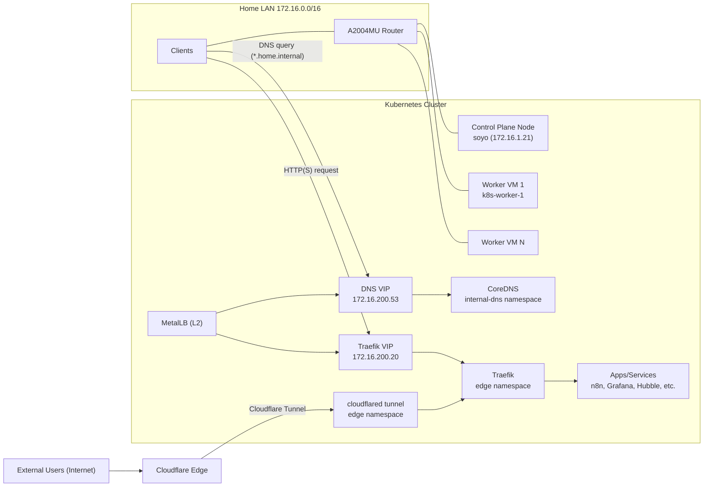
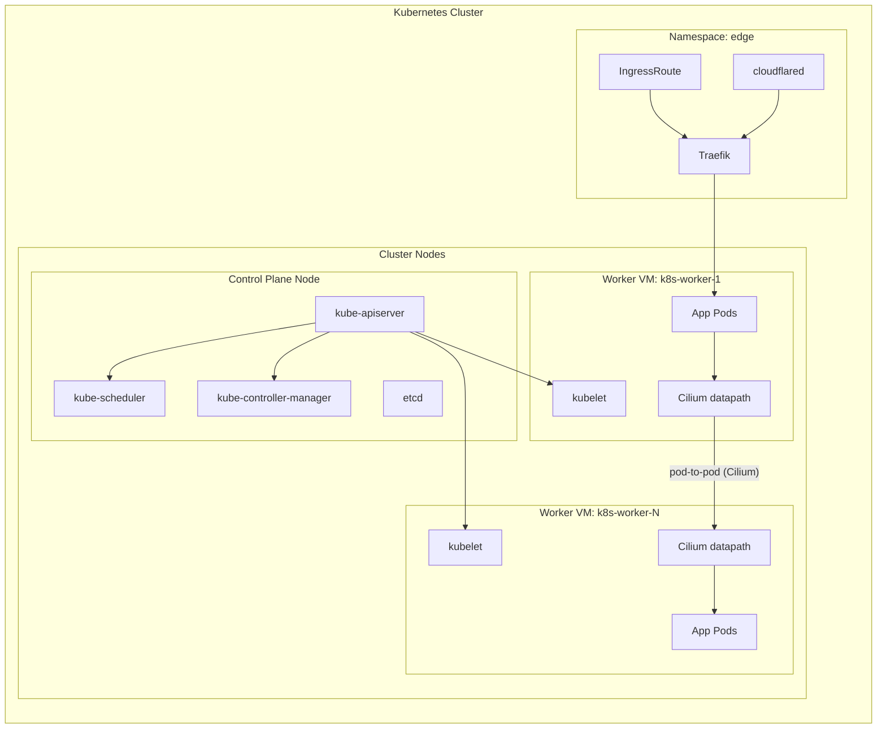

# Infra

> 우리집을 클라우드로!! 

## Traffic Flow

Internal LAN path:
1. Client queries `*.home.internal` to `172.16.200.53`.
2. Internal DNS returns `172.16.200.20` (Traefik VIP).
3. Client sends HTTP(S) request to Traefik.
4. Traefik routes to target service in cluster.

External Internet path:
1. External user reaches Cloudflare.
2. Cloudflare Tunnel forwards traffic to `cloudflared` in `edge` namespace.
3. `cloudflared` forwards to Traefik.
4. Traefik routes to target service in cluster.

## Service Networks 

- LAN network: `172.16.0.0/16`
- VIPs used on LAN:
  - `172.16.200.53` (internal DNS)
  - `172.16.200.20` (Traefik ingress)
- Kubernetes internal networks:
  - Pod IPs are allocated on cluster-internal ranges (for example `10.0.x.x`)
  - Service `ClusterIP` addresses are also cluster-internal (for example `10.96.x.x`, `10.105.x.x`)

This repository keeps the service network model above as-is.

## Kubernetes Cluster Architecture

## Infrastructure Description

- control plane:
  - runs Kubernetes control plane components
  - participates in service exposure through MetalLB L2 advertisement
- worker VMs:
  - run application workloads (n8n, Grafana, monitoring agents, etc.)
  - receive routed traffic from Traefik based on host rules
- MetalLB:
  - allocates and advertises LAN VIPs for `LoadBalancer` services
  - allows direct access from home LAN clients without external cloud LB
- Internal CoreDNS (`internal-dns` namespace):
  - serves `home.internal` zone
  - returns Traefik VIP for service hostnames
- Traefik (`edge` namespace):
  - receives HTTP(S) traffic on `172.16.200.20`
  - forwards requests to backend services using host/path rules

